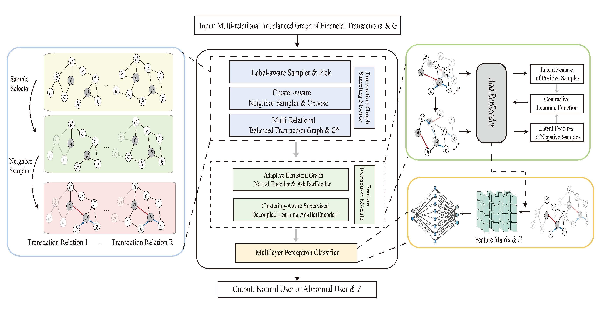

# A novel graph learning framework for interpretable and imbalanced financial fraud detection

## Abstract
Financial fraud poses a severe threat to modern financial systems, making accurate detection crucial. Detecting financial fraud remains highly challenging in real-world systems due to the extreme scarcity of fraudulent activities and adversarial behaviors such as transaction splitting and structural camouflage. These factors lead to class imbalance and graph noise, which pose critical obstacles to the deployment of reliable artificial intelligence-based solutions in high-stakes financial applications. In particular, many existing methods lack interpretability, further restricting their practical applicability. To address these challenges, we propose the imbalance-aware interpretable financial fraud detector, a novel spectral graph learning framework tailored for imbalanced and adversarial financial scenarios. The framework integrates a learnable multi-order, node-adaptive spectral filter that dynamically modulates frequency responses, enabling the model to detect subtle local perturbations while preserving global interpretability. To better represent minority-class nodes, a dynamic neighborhood sampling strategy adaptively reweights neighboring information based on label distribution, structural centrality, and feature relevance. Additionally, we introduce a clustering-aware, self-supervised contrastive learning module that enhances the robustness and discriminability of node embeddings by aligning users with similar behavioral patterns. Experiments on three public financial fraud datasets demonstrate that this model outperforms 12 advanced models and provides multiple built-in interpretability forms, including spectral response analysis, node feature importance, and spatial-spectral theoretical consistency.

 
    

Please stay tuned for updates!
